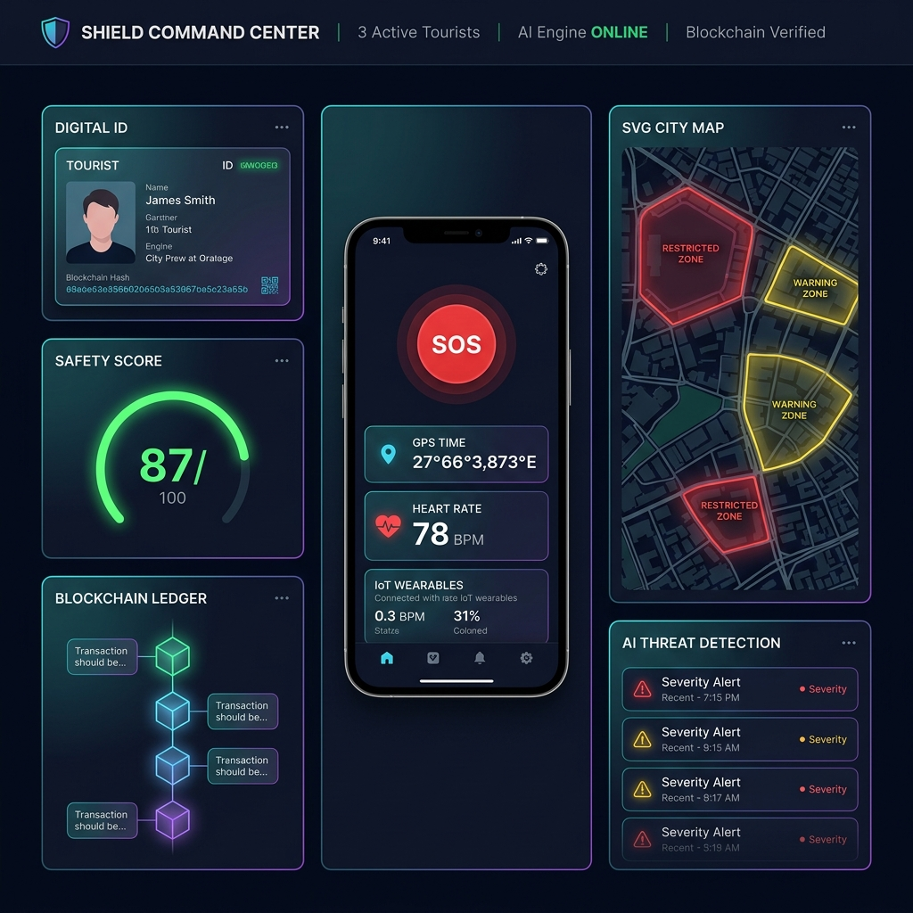

# 🛡️ SHIELD — Smart Tourist Safety Monitoring & Incident Response System

> A production-grade digital safety ecosystem for tourists powered by **real ML anomaly detection (Isolation Forest)**, **Blockchain**, and **Geo-Fencing** technologies.


---



---

## 🌟 Key Features

### 🤖 Real AI Anomaly Detection (Isolation Forest)
- **scikit-learn `IsolationForest`** trained on multi-dimensional tourist telemetry
- Feature vector: `[route_deviation_km, heart_rate, spo2, battery, hrv_proxy]`
- Model warm-starts on 400 synthetic baseline samples at boot — no labelled data required
- **Incremental retraining** every 50 live readings to prevent concept drift
- Physiological override thresholds for critical SpO₂ / cardiac events
- Exposes `modelType`, `featureVector`, and `bufferSize` in every response for full auditability

### 🪪 Digital Tourist ID Platform
- Custom SHA-256 cryptographic blockchain ledger (pure JavaScript, no library)
- Tamper-proof KYC (Aadhaar / Passport) with trip itinerary stored on-chain
- Emergency contacts and time-limited visit IDs at entry points (airports, check-posts)
- One-click blockchain audit with integrity verification across all blocks

### 📱 Tourist Mobile Safety Cockpit
- Auto-assigned **Safety Score** (0–100) based on real-time travel patterns & zone sensitivity
- **Geo-Fencing alerts** with SVG map overlay — restricted zones, danger zones, safe corridors
- **SOS Panic Button** — broadcasts live GPS to nearest police unit and emergency contacts
- IoT wearable telemetry: heart rate, SpO₂, battery, connectivity

### 🏛️ Authority Command Dashboard
- Live heatmap with tourist density visualization across risk zones
- Active alert triage sorted by AI-computed threat score
- **E-FIR** (Electronic First Information Report) auto-generation with blockchain hash, GPS, KYC
- 11-language support: English + Hindi, Tamil, Telugu, Kannada, Malayalam, Bengali, Gujarati, Marathi, Punjabi, Urdu

---

## 🗂️ Project Structure

```
SHIELD-tourist-safety-system/
├── README.md
├── .gitignore
└── smart-tourist-safety-system/
    ├── index.html                        # 3-column command cockpit UI
    ├── styles.css                        # Cyberpunk glassmorphism design system
    ├── app.js                            # Core logic (blockchain, geo-fence, SOS, E-FIR)
    ├── blockchain.js                     # Custom SHA-256 cryptographic ledger
    ├── languages.js                      # 11-language translation dictionary
    ├── docker-compose.yml                # Multi-service orchestration
    ├── dashboard_preview.png             # UI preview
    ├── backend-ai-service/
    │   ├── main.py                       # FastAPI + Isolation Forest anomaly engine
    │   ├── requirements.txt              # scikit-learn, fastapi, uvicorn, numpy
    │   └── Dockerfile
    ├── backend-blockchain-contract/
    │   └── TouristID.sol                 # Solidity ERC-721 tourist ID smart contract
    └── backend-gis-service/
        ├── server.js                     # Node.js geo-fencing & zone boundary service
        ├── package.json
        └── Dockerfile
```

---

## 🚀 Quick Start

### Option 1 — Frontend Only (No Install Required)
```bash
# Just open in any modern browser:
smart-tourist-safety-system/index.html
```

### Option 2 — Full Stack with Docker
```bash
git clone https://github.com/Aikagra-rgb/SHIELD-tourist-safety-system.git
cd SHIELD-tourist-safety-system/smart-tourist-safety-system
docker compose up --build -d
```

Services will be available at:
| Service | URL |
|---------|-----|
| AI Anomaly Engine | http://localhost:8000/docs |
| GIS Geo-Fencing API | http://localhost:8001 |
| Frontend Cockpit | Open `index.html` |

---

## 🛠️ Tech Stack

| Layer | Technology |
|-------|-----------|
| **AI / ML** | scikit-learn `IsolationForest`, NumPy, Python 3.11 |
| **AI API** | FastAPI + Uvicorn (async, auto-docs via Swagger) |
| **Blockchain** | Custom SHA-256 cryptographic ledger (pure JS) |
| **Smart Contract** | Solidity ERC-721 (`TouristID.sol`) |
| **GIS Service** | Node.js + Express (geo-fencing zone validation) |
| **Frontend** | Vanilla HTML5, CSS3, JavaScript ES6+ |
| **Design** | Glassmorphism, cyberpunk dark-mode, CSS micro-animations |
| **Maps** | Custom SVG vector map with geo-fence overlays |
| **Containerization** | Docker & Docker Compose (3-service orchestration) |
| **Fonts** | Google Fonts — Inter, Outfit |

---

## 🤖 AI Engine — How It Works

The `backend-ai-service` runs a **real unsupervised ML pipeline**, not a rule-engine:

```python
# Core model — scikit-learn IsolationForest
from sklearn.ensemble import IsolationForest
from sklearn.preprocessing import StandardScaler

# Features fed per telemetry event:
features = [route_deviation_km, heart_rate, spo2, battery, hrv_proxy]

# Model returns anomaly score → normalised to threat score [0.0 – 1.0]
raw_score = model.decision_function(features_scaled)   # negative = anomalous
threat_score = clip((raw_score * -1 + 0.5), 0.0, 1.0)
```

| Threat Score | Severity | Action |
|---|---|---|
| ≥ 0.75 | 🔴 CRITICAL | Auto-dispatch police + SOS alert |
| ≥ 0.50 | 🟠 HIGH | Authority notified, E-FIR pre-filled |
| ≥ 0.25 | 🟡 MEDIUM | Warning sent to tourist |
| < 0.25 | 🟢 LOW | Monitoring continues |

The model **retrains incrementally** every 50 readings, adapting to each tourist zone's normal baseline without any human labelling.

---

## 📄 License

MIT License — see [LICENSE](LICENSE) for details.

---

## 🤝 Contributing

Pull requests are welcome. For major changes, please open an issue first.

---

*Built for Smart Tourism Safety — Powered by real AI, not rules.*
